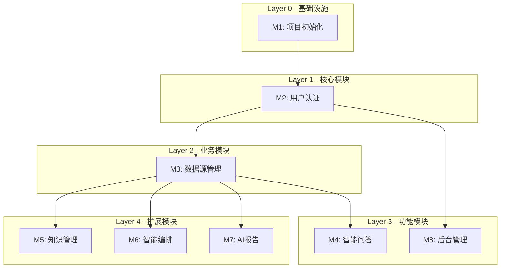

# P5-编码计划

> **For Claude:** REQUIRED SUB-SKILL: Use ideal-dev-exec to implement this plan task-by-task.

**Goal:** 构建智融数据问答平台的前端和业务后端，实现自然语言数据查询、智能编排、AI报告生成等核心功能。

**Architecture:** Next.js 14 前端 + NestJS 后端 + MySQL 数据库，前后端分离，AI 能力通过第三方接口调用。

**Tech Stack:** Next.js 14 / React 18 / shadcn/ui / Tailwind CSS / Zustand / NestJS / Prisma / MySQL

---

## 概述

| 项目 | 内容 |
|------|------|
| 需求名称 | 智融数据问答平台 |
| 技术方案 | P3-技术方案.md |
| 生成日期 | 2026-03-17 |

---

## 模块总览

| 模块编号 | 模块名称 | 任务数 | 依赖 | 执行策略 | 预估时间 |
|----------|----------|--------|------|----------|----------|
| M1 | 项目初始化 | 5 | 无 | parallel | 2h |
| M2 | 用户认证模块 | 6 | M1 | sequential | 3h |
| M3 | 数据源管理模块 | 7 | M2 | sequential | 4h |
| M4 | 智能问答模块 | 8 | M3 | sequential | 6h |
| M5 | 知识管理模块 | 5 | M4 | parallel | 3h |
| M6 | 智能编排模块 | 6 | M3 | parallel | 4h |
| M7 | AI报告模块 | 6 | M3 | parallel | 4h |
| M8 | 后台管理模块 | 5 | M2 | parallel | 3h |

**总计**: 48 个任务

**时间预估**: 串行 29h → 并行优化后 约 20h

---

## 任务依赖图



---

## 并行执行计划

| 批次 | 模块 | 说明 | 预估时间 |
|------|------|------|----------|
| Batch 1 | M1 | 项目初始化（必须先完成） | 2h |
| Batch 2 | M2 | 用户认证（依赖 M1） | 3h |
| Batch 3 | M3 | 数据源管理（依赖 M2） | 4h |
| Batch 4 | M4, M8 | 智能问答 + 后台管理（可并行） | 6h |
| Batch 5 | M5, M6, M7 | 知识管理 + 智能编排 + AI报告（可并行） | 4h |

---

## 模块详情

### M1: 项目初始化

**目标**: 搭建 Monorepo 项目结构，配置开发环境

**依赖**: 无

**执行策略**: sequential

**文件范围**:
- 新增: `package.json`, `turbo.json`, `apps/web/*`, `apps/server/*`, `packages/types/*`

**任务列表**:

---

#### 任务 M1-T1: 初始化 Monorepo 结构

**目标**: 创建 Turborepo Monorepo 项目结构

**验证标准**:
- [ ] `pnpm install` 成功
- [ ] `pnpm build` 成功
- [ ] 目录结构符合技术方案

---

#### 任务 M1-T2: 初始化 Next.js 前端项目

**目标**: 创建 Next.js 14 前端应用，配置 App Router

**验证标准**:
- [ ] `apps/web` 目录创建完成
- [ ] `pnpm dev` 启动成功
- [ ] 访问 `http://localhost:3000` 显示页面

---

#### 任务 M1-T3: 初始化 NestJS 后端项目

**目标**: 创建 NestJS 后端应用，配置基础模块

**验证标准**:
- [ ] `apps/server` 目录创建完成
- [ ] `pnpm dev:server` 启动成功
- [ ] 访问 `http://localhost:3001/api` 显示 Swagger 文档

---

#### 任务 M1-T4: 配置 shadcn/ui 和 Tailwind CSS

**目标**: 集成 shadcn/ui 组件库，配置水墨风格主题

**验证标准**:
- [ ] `tailwind.config.js` 配置水墨色板
- [ ] `shadcn/ui` 组件可正常使用
- [ ] 全局样式 `ink-wash.css` 创建完成

---

#### 任务 M1-T5: 配置 Prisma 和数据库连接

**目标**: 初始化 Prisma，创建数据库 Schema，执行迁移

**验证标准**:
- [ ] `prisma/schema.prisma` 创建完成
- [ ] `prisma migrate dev` 执行成功
- [ ] 数据库表创建成功

---

### M2: 用户认证模块

**目标**: 实现用户登录、登出、权限控制

**依赖**: M1

**执行策略**: sequential

**文件范围**:
- 新增: `apps/server/src/modules/user/*`, `apps/web/src/app/(auth)/*`

**任务列表**:

---

#### 任务 M2-T1: 实现用户数据模型

**目标**: 创建 User 模型和 Prisma Schema

**验证标准**:
- [ ] Prisma Schema 包含 User 模型
- [ ] 数据库迁移成功
- [ ] Prisma Client 可正常使用

---

#### 任务 M2-T2: 实现用户注册 API

**目标**: 创建 POST /api/auth/register 接口

**验证标准**:
- [ ] 接口返回正确的响应
- [ ] 密码加密存储
- [ ] 单元测试通过

---

#### 任务 M2-T3: 实现用户登录 API

**目标**: 创建 POST /api/auth/login 接口，返回 JWT Token

**验证标准**:
- [ ] 正确的用户名密码返回 Token
- [ ] 错误的用户名密码返回 401
- [ ] 单元测试通过

---

#### 任务 M2-T4: 实现 JWT 认证守卫

**目标**: 创建 JWT 认证守卫，保护需要登录的接口

**验证标准**:
- [ ] 无 Token 访问受保护接口返回 401
- [ ] 有效 Token 访问成功
- [ ] 过期 Token 返回 401

---

#### 任务 M2-T5: 实现前端登录页面

**目标**: 创建登录页面，集成登录 API

**验证标准**:
- [ ] 登录页面 UI 符合水墨风格
- [ ] 登录成功跳转首页
- [ ] 登录失败显示错误提示

---

#### 任务 M2-T6: 实现前端布局框架

**目标**: 创建主布局，包含顶部导航和侧边栏

**验证标准**:
- [ ] 布局响应式适配
- [ ] 导航菜单正常工作
- [ ] 侧边栏可收起

---

### M3: 数据源管理模块

**目标**: 实现数据源的增删改查、连接测试、表管理

**依赖**: M2

**执行策略**: sequential

**文件范围**:
- 新增: `apps/server/src/modules/datasource/*`, `apps/web/src/app/(main)/admin/datasources/*`

**任务列表**:

---

#### 任务 M3-T1: 实现数据源数据模型

**目标**: 创建 DataSource、DataSourceTable、TableField 模型

**验证标准**:
- [ ] Prisma Schema 包含所有模型
- [ ] 数据库迁移成功
- [ ] 模型关系正确

---

#### 任务 M3-T2: 实现数据源列表 API

**目标**: 创建 GET /api/datasources 接口

**验证标准**:
- [ ] 返回分页数据
- [ ] 支持搜索过滤
- [ ] 单元测试通过

---

#### 任务 M3-T3: 实现创建数据源 API

**目标**: 创建 POST /api/datasources 接口

**验证标准**:
- [ ] 支持多种数据源类型
- [ ] 连接配置加密存储
- [ ] 单元测试通过

---

#### 任务 M3-T4: 实现测试连接 API

**目标**: 创建 POST /api/datasources/:id/test 接口

**验证标准**:
- [ ] 返回连接状态
- [ ] 返回错误信息（连接失败时）
- [ ] 单元测试通过

---

#### 任务 M3-T5: 实现获取表列表 API

**目标**: 创建 GET /api/datasources/:id/tables 接口

**验证标准**:
- [ ] 返回数据源下的所有表
- [ ] 包含表注释信息
- [ ] 单元测试通过

---

#### 任务 M3-T6: 实现前端数据源列表页

**目标**: 创建数据源列表页面，展示数据源卡片

**验证标准**:
- [ ] 列表展示正常
- [ ] 支持搜索和筛选
- [ ] 卡片操作按钮正常

---

#### 任务 M3-T7: 实现前端数据源配置流程

**目标**: 创建三步配置流程：连接配置 → 表选择 → 字段元数据

**验证标准**:
- [ ] 三步流程正常
- [ ] 连接测试功能正常
- [ ] 表选择和字段编辑功能正常

---

### M4: 智能问答模块

**目标**: 实现自然语言问答、多轮对话、结果展示、反馈收集

**依赖**: M3

**执行策略**: sequential

**文件范围**:
- 新增: `apps/server/src/modules/chat/*`, `apps/web/src/app/(main)/chat/*`, `apps/web/src/lib/ai/*`

**任务列表**:

---

#### 任务 M4-T1: 实现会话数据模型

**目标**: 创建 Session、Message、Feedback 模型

**验证标准**:
- [ ] Prisma Schema 包含所有模型
- [ ] 数据库迁移成功
- [ ] 模型关系正确

---

#### 任务 M4-T2: 实现会话管理 API

**目标**: 创建会话 CRUD 接口

**验证标准**:
- [ ] POST /api/sessions 创建会话
- [ ] GET /api/sessions 获取列表
- [ ] DELETE /api/sessions/:id 删除会话

---

#### 任务 M4-T3: 实现 WebSocket 问答封装

**目标**: 封装 AI 服务的 WebSocket 接口

**验证标准**:
- [ ] `useChatWebSocket` Hook 创建完成
- [ ] 支持消息发送和接收
- [ ] 支持断线重连

---

#### 任务 M4-T4: 实现打字机效果组件

**目标**: 创建 StreamOutput 组件

**验证标准**:
- [ ] 打字机效果正常
- [ ] 光标闪烁动画
- [ ] 支持暂停和继续

---

#### 任务 M4-T5: 实现前端会话列表

**目标**: 创建会话列表组件

**验证标准**:
- [ ] 会话列表展示正常
- [ ] 支持新建会话
- [ ] 支持删除会话

---

#### 任务 M4-T6: 实现前端消息列表

**目标**: 创建消息列表组件，展示问答内容

**验证标准**:
- [ ] 消息气泡样式符合水墨风格
- [ ] 支持 Markdown 渲染
- [ ] 支持代码高亮

---

#### 任务 M4-T7: 实现前端输入框

**目标**: 创建问答输入框组件

**验证标准**:
- [ ] 支持多行输入
- [ ] 支持多轮问答开关
- [ ] 支持快捷键发送

---

#### 任务 M4-T8: 实现反馈功能

**目标**: 创建反馈弹窗和 API

**验证标准**:
- [ ] 正向反馈点击提交
- [ ] 负向反馈弹窗填写
- [ ] 反馈存储到数据库

---

### M5: 知识管理模块

**目标**: 实现业务知识和案例库的管理

**依赖**: M4

**执行策略**: parallel

**文件范围**:
- 新增: `apps/server/src/modules/knowledge/*`, `apps/web/src/app/(main)/admin/knowledge/*`

**任务列表**:

---

#### 任务 M5-T1: 实现知识数据模型

**目标**: 创建 Knowledge 模型

**验证标准**:
- [ ] Prisma Schema 包含 Knowledge 模型
- [ ] 数据库迁移成功

---

#### 任务 M5-T2: 实现知识管理 API

**目标**: 创建知识 CRUD 接口

**验证标准**:
- [ ] 支持增删改查
- [ ] 支持分类筛选
- [ ] 支持搜索

---

#### 任务 M5-T3: 实现向量同步 API

**目标**: 创建 POST /api/knowledge/sync 接口

**验证标准**:
- [ ] 调用 AI 服务同步接口
- [ ] 返回同步状态

---

#### 任务 M5-T4: 实现前端知识列表

**目标**: 创建知识列表页面

**验证标准**:
- [ ] 列表展示正常
- [ ] 支持搜索和分类
- [ ] 支持增删改操作

---

#### 任务 M5-T5: 实现前端知识编辑弹窗

**目标**: 创建知识编辑弹窗，支持联网查询

**验证标准**:
- [ ] 表单验证正常
- [ ] 联网查询功能正常
- [ ] 保存功能正常

---

### M6: 智能编排模块

**目标**: 实现流程编辑器、节点执行、结果展示

**依赖**: M3

**执行策略**: parallel

**文件范围**:
- 新增: `apps/server/src/modules/workflow/*`, `apps/web/src/app/(main)/workflow/*`

**任务列表**:

---

#### 任务 M6-T1: 实现工作流数据模型

**目标**: 创建 Workflow 模型

**验证标准**:
- [ ] Prisma Schema 包含 Workflow 模型
- [ ] 数据库迁移成功

---

#### 任务 M6-T2: 实现工作流管理 API

**目标**: 创建工作流 CRUD 接口

**验证标准**:
- [ ] 支持增删改查
- [ ] 流程定义 JSON 存储

---

#### 任务 M6-T3: 实现前端流程编辑器

**目标**: 创建基于 React Flow 的流程编辑器

**验证标准**:
- [ ] 支持节点拖拽
- [ ] 支持连线
- [ ] 支持节点配置

---

#### 任务 M6-T4: 实现前端节点面板

**目标**: 创建节点配置面板

**验证标准**:
- [ ] 节点参数编辑正常
- [ ] 节点类型展示

---

#### 任务 M6-T5: 实现节点执行功能

**目标**: 调用 AI 服务执行节点

**验证标准**:
- [ ] SSE 流式输出
- [ ] 执行结果展示

---

#### 任务 M6-T6: 实现执行结果面板

**目标**: 创建执行结果展示面板

**验证标准**:
- [ ] 流式输出展示
- [ ] 结果表格展示

---

### M7: AI报告模块

**目标**: 实现大纲编辑、内容生成、富文本编辑

**依赖**: M3

**执行策略**: parallel

**文件范围**:
- 新增: `apps/server/src/modules/report/*`, `apps/web/src/app/(main)/report/*`

**任务列表**:

---

#### 任务 M7-T1: 实现报告数据模型

**目标**: 创建 Report 模型

**验证标准**:
- [ ] Prisma Schema 包含 Report 模型
- [ ] 数据库迁移成功

---

#### 任务 M7-T2: 实现报告管理 API

**目标**: 创建报告 CRUD 接口

**验证标准**:
- [ ] 支持增删改查
- [ ] 大纲和内容存储

---

#### 任务 M7-T3: 实现前端报告列表

**目标**: 创建报告列表页面

**验证标准**:
- [ ] 列表展示正常
- [ ] 支持新建报告

---

#### 任务 M7-T4: 实现前端大纲编辑器

**目标**: 创建大纲编辑器，支持拖拽排序

**验证标准**:
- [ ] 章节增删改
- [ ] 拖拽排序
- [ ] 小节管理

---

#### 任务 M7-T5: 实现前端富文本编辑器

**目标**: 集成 TipTap/Lexical 富文本编辑器

**验证标准**:
- [ ] 基础格式化功能
- [ ] 工具栏正常

---

#### 任务 M7-T6: 实现报告生成功能

**目标**: 调用 AI 服务生成报告

**验证标准**:
- [ ] 大纲生成正常
- [ ] 内容生成正常
- [ ] SSE 流式输出

---

### M8: 后台管理模块

**目标**: 实现用户管理、服务监控、反馈管理

**依赖**: M2

**执行策略**: parallel

**文件范围**:
- 新增: `apps/server/src/modules/monitor/*`, `apps/server/src/modules/feedback/*`, `apps/web/src/app/(main)/admin/*`

**任务列表**:

---

#### 任务 M8-T1: 实现用户管理 API

**目标**: 创建用户管理 CRUD 接口

**验证标准**:
- [ ] 支持增删改查
- [ ] 支持启停用户

---

#### 任务 M8-T2: 实现前端用户管理页

**目标**: 创建用户管理页面

**验证标准**:
- [ ] 用户列表展示
- [ ] 增删改功能正常

---

#### 任务 M8-T3: 实现服务监控 API

**目标**: 创建监控指标接口

**验证标准**:
- [ ] 返回核心指标
- [ ] 返回趋势数据

---

#### 任务 M8-T4: 实现前端服务监控页

**目标**: 创建服务监控页面

**验证标准**:
- [ ] 指标卡片展示
- [ ] 趋势图表展示

---

#### 任务 M8-T5: 实现前端反馈管理页

**目标**: 创建反馈管理页面

**验证标准**:
- [ ] 反馈列表展示
- [ ] 详情查看
- [ ] 导出功能

---

## 最终验证

**所有批次完成后必须验证**：

```bash
# 运行完整测试套件
pnpm test

# 构建项目
pnpm build

# 预期：所有测试通过，构建成功
```

**验证清单**：
- [ ] 所有测试通过（有输出证据）
- [ ] 所有任务已完成
- [ ] 代码已提交
- [ ] 前端页面可访问
- [ ] 后端 API 可调用

---

## 验收标准

| 编号 | 标准 | 验证方式 |
|------|------|----------|
| AC-1 | 用户可登录/登出 | 手动测试 |
| AC-2 | 数据源可配置和测试连接 | 手动测试 |
| AC-3 | 问答功能正常，支持流式输出 | 手动测试 |
| AC-4 | 知识可增删改查 | 手动测试 |
| AC-5 | 编排功能正常 | 手动测试 |
| AC-6 | 报告生成正常 | 手动测试 |
| AC-7 | 后台管理功能正常 | 手动测试 |
| AC-8 | 所有 API 单元测试通过 | `pnpm test` |

---

## 风险与应对

| 风险 | 影响 | 应对措施 |
|------|------|----------|
| AI 接口不稳定 | 高 | 实现重试机制和降级策略 |
| 开发环境配置问题 | 中 | 提供 Docker Compose 配置 |
| 技术栈不熟悉 | 中 | 参考官方文档和示例代码 |

---

## 执行交接

计划已完成。选择执行方式：

**选项 1: Subagent-Driven (当前会话)**
- 每任务派遣子代理
- 任务间两阶段审查（规范合规 + 代码质量）
- 快速迭代

**选项 2: Parallel Session (独立会话)**
- 打开新会话
- 调用 ideal-dev-exec 批量执行
- 批次间检查点

---

*文档版本: v1.0*
*创建时间: 2026-03-17*
*作者: Claude Code*
