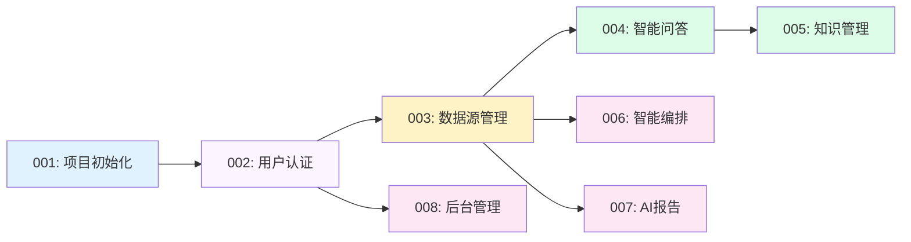

# 故事索引

## 概览

| 故事 | 标题 | 状态 | 优先级 | 依赖 | 预估时间 |
|------|------|------|--------|------|----------|
| [001](001-项目初始化.md) | 项目初始化与环境搭建 | ⏳ 待开始 | P0 | - | 2h |
| [002](002-用户认证模块.md) | 用户认证模块 | ⏳ 待开始 | P0 | 001 | 2h |
| [003](003-数据源管理模块.md) | 数据源管理模块 | ⏳ 待开始 | P0 | 002 | 3h |
| [004](004-智能问答模块.md) | 智能问答模块 | ⏳ 待开始 | P0 | 003 | 5h |
| [005](005-知识管理模块.md) | 知识管理模块 | ⏳ 待开始 | P0 | 004 | 2h |
| [006](006-智能编排模块.md) | 智能编排模块 | ⏳ 待开始 | P1 | 003 | 3h |
| [007](007-AI报告模块.md) | AI报告模块 | ⏳ 待开始 | P1 | 003 | 3h |
| [008](008-后台管理模块.md) | 后台管理模块 | ⏳ 待开始 | P1 | 002 | 2h |

**总预估时间**: 串行 22h / 并行优化后 约 16h

**架构**: Next.js 14 全栈（App Router + API Routes + Prisma）

---

## 依赖关系

---

## 执行顺序

### Batch 1 - 基础设施
- 001: 项目初始化与环境搭建 (2h)

### Batch 2 - 核心模块
- 002: 用户认证模块 (2h)

### Batch 3 - 业务模块
- 003: 数据源管理模块 (3h)

### Batch 4 - 功能模块（可并行）
- 004: 智能问答模块 (5h)
- 008: 后台管理模块 (2h)

### Batch 5 - 扩展模块（可并行）
- 005: 知识管理模块 (2h)
- 006: 智能编排模块 (3h)
- 007: AI报告模块 (3h)

---

## 状态说明

| 状态 | 符号 | 说明 |
|------|------|------|
| ⏳ 待开始 | pending | 尚未开始 |
| 🔄 进行中 | in_progress | 正在开发 |
| ✅ 已完成 | completed | 已完成验收 |
| ❌ 已阻塞 | blocked | 遇到阻塞 |

---

## 进度统计

- **P0 任务**: 5 个（001, 002, 003, 004, 005）
- **P1 任务**: 3 个（006, 007, 008）
- **当前进度**: 0/8 (0%)

---

*最后更新: 2026-03-17*
*架构版本: v2.0 (Next.js 全栈)*
